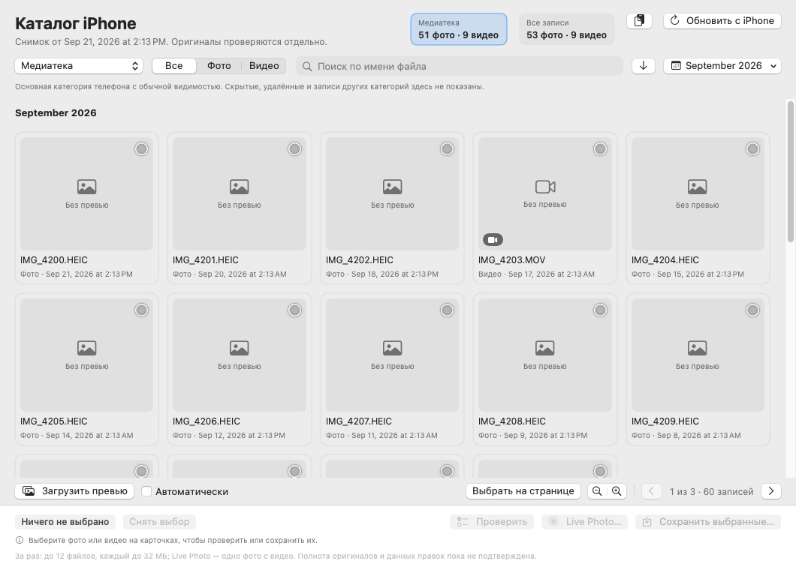
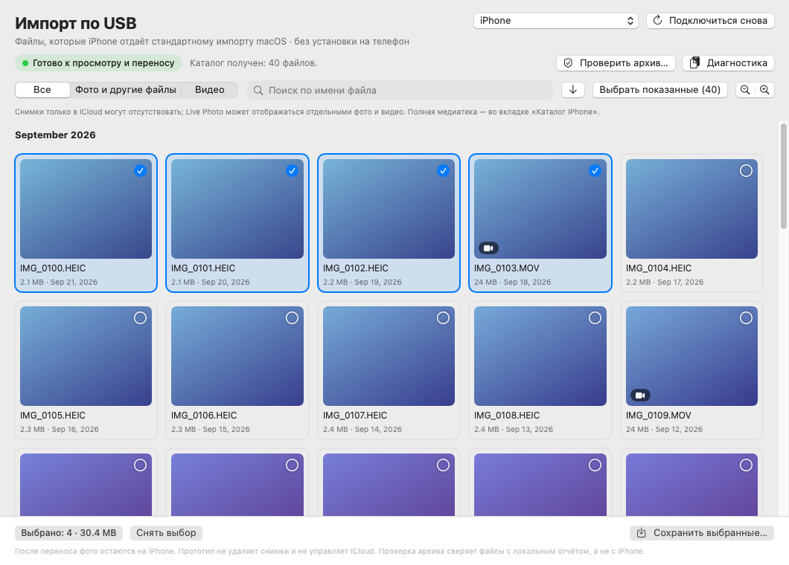
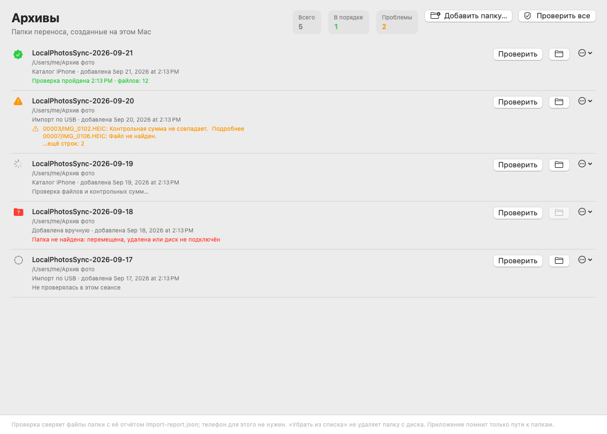

# LocalPhotosSync

Нативное приложение для macOS 14+: просмотр фото и видео iPhone на Mac, выбор и сохранение в независимый локальный архив с отчётом и контрольными суммами. На iPhone ничего устанавливать не нужно; данные идут с самого телефона по USB. Медиатека «Фото» на Mac не используется.

Версия 0.17.0 — прототип. Работает:

- каталог всей медиатеки телефона;
- превью, проверка наличия файлов;
- сохранение до 12 файлов за раз и одной Live Photo;
- стандартный USB-импорт;
- повторная проверка архива, в том числе всех сохранённых папок сразу.

Пока нет:

- получения оригиналов, которые хранятся только в iCloud;
- подтверждения полноты правок;
- удаления с телефона.

План и история — в [docs/roadmap.md](docs/roadmap.md).

## Запуск

Нужны Xcode или инструменты командной строки с поддержкой Swift 6.

```sh
zsh scripts/build-app.sh
open '.build/LocalPhotosSync USB.app'
```

Сборка сначала готовит и проверяет новый экземпляр приложения, затем заменяет текущую папку. Прежний экземпляр сохраняется в `.build/previous-apps/`: его исполняемые файлы не перезаписываются, поэтому запущенный процесс может закончить работу. Для использования новой версии перезапустите приложение после окончания переноса.

Вкладке «Каталог iPhone» нужен локальный runtime из [AFC-эксперимента](experiments/afc/README.md). Вкладка «Импорт по USB» работает через системный ImageCaptureCore и runtime не требует.

## Вкладка «Каталог iPhone»

Список фото и видео читается из базы самого телефона через доверенное USB-подключение (AFC). Это частная схема iOS. Совпадение области с приложением «Фото» и доступность оригиналов проверяются отдельно.



**Экран.**

- **Сверху:** дата снимка каталога и счётчики «Медиатека» и «Все записи» (нажатие переключает категорию). Кнопка «Обновить с iPhone» (⌘R) получает новый снимок; при ошибке прежний каталог сохраняется. Кнопка с буфером обмена копирует диагностику каталога: версии, наличие AFC runtime и python3, число снимков, счётчики и последнюю ошибку, без имён файлов и идентификаторов телефона.
- **Фильтры:** категория, тип, поиск по имени, порядок (стрелка: сначала новые или старые, запоминается) и меню месяца (календарь). Меню переходит к нужному месяцу и показывает число записей за месяц с учётом фильтров.
- **Сетка:** карточки по 24 на страницу с заголовками месяцев.
- **Под сеткой:** «Загрузить превью» (порциями до 12 фото и видео), флажок «Автоматически», «Выбрать на странице», размер карточек (⌘− и ⌘=, запоминается) и переход между страницами (⌘[ и ⌘]).
- **Нижняя панель:** сколько выбрано из 12 (нажатие показывает только выбранные карточки со всех страниц; повторное — возвращает все), «Проверить», «Live Photo…», «Сохранить выбранные…» (⌘S), «Остановить» во время работы и «Открыть папку» после переноса.
- **Область состояния** под панелью показывает ход переноса и проверки, превью и причину, по которой действие сейчас недоступно (например, выбрано больше 12). Длинный отчёт сворачивается; полный текст открывает «Подробнее».
- **Подсказки после действий** появляются под сообщениями, только когда они применимы:
  - «Убрать недоступные (N)» — после «Проверить» снимает выбор с карточек, у которых файл не найден, слишком велик или проверка не удалась; непроверенные остаются;
  - «Выбрать несохранённые (N)» — после частичного переноса заменяет выбор файлами, которые не сохранились, чтобы повторить попытку.
- **Правый клик по карточке:** «Просмотр…» открывает её крупно с датой, типом и итогом проверки (← и → — соседние карточки страницы, пробел — выбрать, Esc — закрыть; если превью ещё нет, его можно загрузить прямо там); также можно выбрать её, проверить или сохранить один файл, сохранить как Live Photo.

**Категории.** По умолчанию показана основная видимая медиатека; выбранные категория и тип запоминаются между запусками. «Все записи» включает дополнительные категории, скрытые элементы и серии; превью для них не загружаются.

**Превью.** Автоматическая загрузка выключена по умолчанию.

- Если её включить, превью страницы загружаются через долю секунды после открытия. Быстрое листание и набор в поиске не запускают загрузку для промежуточных страниц.
- После ошибки подключения или при отсутствии привязки снимка к телефону автозагрузка ждёт ручного нажатия «Загрузить превью», чтобы не повторять запросы к телефону в цикле.
- При переходе на другую страницу или смене фильтра текущая порция останавливается после текущего файла. Уже загруженные превью сохраняются.
- Во время USB-импорта во второй вкладке автозагрузка не запускается.
- Совпадение подключённого телефона со снимком проверяется до чтения превью.
- Превью не подтверждает наличие оригинала.

**Выбор и сохранение.**

- Выбор сохраняется между страницами. «Выбрать на странице» добавляет фото и видео страницы, пока выбрано не больше 12. Shift-щелчок по карточке добавляет все карточки от предыдущего щелчка до этой, тоже до 12, начиная с нажатой: при обрезке остаются она и её соседи. Смена фильтра или «Снять выбор» сбрасывают начало диапазона.
- «Сохранить выбранные…» предлагает папку на Mac и создаёт в ней отдельную папку переноса с отчётом проверки, например `LocalPhotosSync-2026-10-01T20-45-12Z-3F2A9C1E` (для Live Photo — `LocalPhotosSync-LivePhoto-…`). Лимит — 12 файлов, каждый до 32 МиБ.
- «Остановить» сохраняет незавершённый отчёт. Недоступные файлы дают неполный результат, успешные копии остаются.
- SHA-256 полученного потока сравнивается с повторным чтением копии и файла в выбранной папке.
- Если сохранить не удалось, показываются причины первых трёх ошибок; нулевой результат обозначается как «Не удалось сохранить файлы: 0 из …». При отсутствии файла на телефоне предлагается открыть фото или видео на iPhone, дождаться загрузки и повторить «Проверить».

**Live Photo.** Для одной неотредактированной Live Photo выберите её карточку и нажмите «Live Photo…».

- Сохраняются доступное изображение и его MOV; проверяются хеши, связь пары и итоговый архив. Лимит — по 32 МиБ на фото и видео.
- Если пара недоступна или не прошла проверку, завершённый перенос не объявляется. «Остановить» действует и здесь.
- «Сохранить выбранные…» сохраняет отдельные файлы.

**Проверка наличия.** «Проверить» (до 12 карточек) показывает на карточках размер и время проверки либо «Файл не найден», «Ошибка проверки» или превышение лимита переноса.

- Для Live Photo проверяется основной файл фотографии; видео и связь пары — при сохранении.
- Это наличие файла в момент проверки, а не его целостность или полнота оригинала.
- Ошибка соединения не считается отсутствием файла. Причина отсутствия этой проверкой не устанавливается.
- Проверка не создаёт архив, не ставит отметку «сохранено» и останавливается кнопкой «Остановить».

**Источник каталога.** Для загрузки допускается только снимок с успешным отчётом копирования, корректными размерами базы/WAL и приватным файлом отчёта. Повреждённые данные, неизвестная схема и незавершённые копии не должны выглядеть пустой медиатекой.

## Вкладка «Импорт по USB»

Показывает только файлы, которые iPhone отдаёт стандартному импорту macOS (ImageCaptureCore).



**Экран.**

- **Сверху:** выбор iPhone и «Подключиться снова» (⌘R).
- **Состояние:** цветной индикатор подключения (ожидание, разблокировка, загрузка списка, готово, ошибка) с текущим сообщением, кнопки «Проверить архив…» и «Диагностика».
- **Фильтры:** тип файлов, поиск, порядок (сначала новые или старые), «Выбрать показанные» и размер карточек (⌘− и ⌘=, запоминается отдельно от каталога), затем сетка карточек с заголовками месяцев. Shift-щелчок выбирает все показанные файлы между предыдущим щелчком и текущим; лимита 12 у стандартного импорта нет.
- **Нижняя панель:** выбранное количество и объём (нажатие показывает только выбранные файлы), ход переноса с полосой прогресса и «Отменить перенос», «Открыть папку» и «Сохранить выбранные…» (⌘S).
- **Итоги:** результат переноса и проверки архива окрашивается по исходу; длинный отчёт об ошибках открывается кнопкой «Подробнее».

**Первая проверка.**

1. Подключите iPhone к Mac кабелем.
2. Разблокируйте его и подтвердите «Доверять этому компьютеру», если появится запрос.
3. Разрешите доступ на Mac, если система его запросит. На время проверки закройте другие программы импорта с телефона.
4. Дождитесь списка файлов и выберите несколько фото и короткое видео.
5. Нажмите «Сохранить выбранные…» и выберите папку вне iCloud Drive.
6. Откройте полученную папку и проверьте воспроизведение/просмотр файлов. В `import-report.json` записаны результаты импорта.
7. Нажмите «Проверить архив…» и выберите созданную папку. Эта проверка доступна и после отключения iPhone.

**Архив.**

- Каждый запуск импорта создаёт новую папку; каждый файл сохраняется в отдельную подпапку, чтобы одинаковые имена и сопутствующие файлы не перезаписывали друг друга.
- Полученный файл читается целиком потоковым способом, сверяется его размер, рассчитывается SHA-256. Доступные сопутствующие файлы в той же подпапке тоже получают контрольные суммы. Это **не** сравнение с контрольной суммой исходника на iPhone.
- Отчёт создаётся до первого копирования и остаётся незавершённым до обработки всей выборки. «Отменить перенос» и отключение телефона оставляют незавершённый отчёт: частичный импорт не должен выглядеть готовым архивом. Полученные файлы сохраняются, исходники на телефоне не меняются.

**Проверка архива** обнаруживает:

- отсутствующие файлы;
- изменение размера и контрольной суммы;
- ошибки и незавершённость импорта.

Относительные пути позволяют переместить папку архива целиком и проверить её на новом месте. Старые отчёты без признака завершённости не считаются подтверждённо завершёнными.

**Диагностика** копирует версию macOS и приложения, состояние подключения и числовые показатели. Серийные номера и имена фотографий в неё не включаются.

**Окно** открывается на вкладке, которая была открыта в прошлый раз.

**Настройки** (⌘,) собирают в одном окне автозагрузку превью, порядок и размер карточек обеих вкладок, а также новую возможность — проверять архивы при запуске, если с последней проверки прошло больше заданного числа дней (по умолчанию выключено). Там же можно забыть последнюю папку сохранения.

**Папка для сохранения** в обеих вкладках выбирается одинаково: окно выбора открывается в последней использованной папке. Если выбранная папка синхронизируется с iCloud (iCloud Drive или «Рабочий стол» и «Документы» при включённой синхронизации), приложение предупреждает: такой архив не независим от iCloud, и при оптимизации хранения macOS может выгрузить его файлы с Mac. Можно выбрать другую папку или сохранить всё равно.

**Перенос в фоне.** Пока идёт сохранение, на значке в Dock виден ход USB-импорта («2/4») или стрелка для сохранения из каталога. Если перенос закончился, пока приложение в фоне, значок один раз подпрыгивает. Разрешения на уведомления для этого не нужны.

## Вкладка «Архивы»

Список папок переноса, созданных на этом Mac. 



Папка попадает в список, когда:

- в каталоге завершается сохранение файлов или Live Photo;
- заканчивается USB-импорт, в том числе отменённый или прерванный: такая папка видна как незавершённая;
- существующую папку с `import-report.json` добавили кнопкой «Добавить папку…».

«Проверить все» (⌘R) или «Проверить» в строке сверяет каждую папку с её отчётом без телефона. Строка показывает итог:

- «Проверка пройдена» с числом файлов;
- список расхождений: отсутствующие или изменённые файлы, незавершённый импорт; длинный список открывается кнопкой «Подробнее»;
- «Папка не найдена», если папка перемещена, удалена или диск не подключён.

В строке также видны число файлов и объём из отчёта папки. Итог последней проверки сохраняется между запусками: «Последняя проверка 3 дня назад: в порядке». Подробности расхождений не сохраняются, потому что в них есть имена файлов; чтобы увидеть их снова, проверьте папку ещё раз.

Сверху — счётчики «Всего», «В порядке» и «Проблемы»; нажатие на «Проблемы» оставляет в списке только папки с расхождениями или ненайденные. Меню строки открывает `import-report.json` папки. Кнопка с папкой показывает её в Finder. «Убрать из списка» не удаляет папку с диска.

Приложение хранит только пути к папкам, даты и итог последней проверки (исход и число файлов или расхождений), ничего о телефоне: `~/Library/Application Support/LocalPhotosSync/archive-history.json` (доступ только для владельца). Результаты проверок держатся в памяти до закрытия приложения. Папка записывается, даже если окно закрыли до конца переноса. Если файл списка повреждён, он не перезаписывается: приложение сохраняет его рядом как `archive-history.unreadable-….json` и начинает новый список.

## Ограничения

- **Удаление.** Приложение не удаляет фотографии и не изменяет библиотеку iCloud. Удаление появится только после доказанной полноты архива: [постановка задачи и варианты](docs/problem-and-options.md).
- **Объём стандартного импорта.** На первом проверенном телефоне с оптимизацией хранения iCloud стандартный USB-импорт отдал 326 изображений и 6 видео. Пользователь сообщил о 2 132 фото и 429 видео в «Фото» на iPhone. Каталог из базы телефона показал 2 138 фото и 429 видео основной видимой категории; разница в шесть фото пока не объяснена.
- **Наличие файлов.** Наличие записи или превью не гарантирует, что файл можно перенести. [Об ограничениях и эксперименте](docs/missing-media.md), [оригиналы на телефоне](docs/phone-originals.md).
- **Live Photo и форматы.** В стандартном импорте Live Photo может показываться парой отдельных файлов. Если iPhone преобразует формат, проверка размера может сообщить ошибку; такой результат нельзя считать успешным архивированием. Для оригинальных форматов на iPhone можно выбрать: Настройки → Приложения → Фото → Перенос на Mac или ПК → Сохранять оригиналы (название и путь зависят от версии iOS).
- **Медиатека Mac.** Чтение «Фото» на Mac исключено: команда `--probe-mac-library` отключена, разрешение не требуется. Код прежнего эксперимента — в `experiments/mac-photos/`, вне сборки.
- **Wi-Fi.** Веб-приложение по Wi-Fi получает только файлы, вручную выбранные на iPhone, а не доступ ко всей медиатеке. Поэтому первым транспортом выбран USB. Wi-Fi через сопряжение с компьютером проверяется отдельно: [Wi-Fi-проба](docs/wifi-probe.md).
- **PhotoKit на iPhone.** Остаётся запасным вариантом для ресурсов, недоступных через файловый транспорт. Его можно установить через Xcode без App Store, но сейчас он не используется.

## Командная строка

После сборки:

```sh
app='.build/LocalPhotosSync USB.app/Contents/MacOS/LocalPhotosSyncUSB'
"$app" --diagnose --seconds 5
"$app" --verify-archive '/путь/к/папке/архива'
"$app" --verify-archives
mkdir -p .build/device-probe && "$app" --probe-import '.build/device-probe' --seconds 60
python3 scripts/diagnose-environment.py --browse-seconds 5
```

- `--diagnose` ждёт указанное число секунд и выводит состояние подключения и числовые показатели без имён устройств и файлов.
- `--verify-archive` проверяет сохранённую папку без телефона. Коды выхода: 0 — проверка прошла, 1 — проблема с архивом, 2 — ошибка запуска или чтения отчёта.
- `--verify-archives [--history <файл>]` проверяет все папки из вкладки «Архивы». Файл списка она только читает; по умолчанию берёт `~/Library/Application Support/LocalPhotosSync/archive-history.json`. Для каждой папки выводит `passed`, `failed` или `missing` с расхождениями. Коды выхода: 0 — все в порядке (или список по умолчанию ещё пуст), 1 — есть проблемы, 2 — список не прочитан или явно указанный файл не найден. Команду удобно запускать по расписанию.
- `--probe-import` **скачивает** с подключённого разблокированного iPhone одну самую маленькую доступную фотографию и, если есть подходящее видео, одно видео (каждое до 32 МБ, с известным размером). Требуются ровно одно устройство и транспорт USB.
  - Сопутствующие файлы в этой пробе не загружаются, поэтому полноту Live Photo она не проверяет; обычный перенос из окна их сохраняет.
  - Коды выхода: 0 — импорт и проверка прошли, 1 — ошибка или тайм-аут, 2 — неправильные аргументы.
  - `selectedVideos: 0` значит, что перенос видео не проверялся.
  - На тайм-ауте отчёт остаётся незавершённым.
- Все эти команды выводят JSON.
- Python-скрипт считает USB-устройства iOS, объявления Bonjour и устройства usbmuxd. Он не создаёт сопряжение и не читает фотографии. Наличие объявления в сети ещё не подтверждает доступ к телефону.

Результаты реальных переносов — в [протоколе устройства](docs/device-test-results.md).

## Разработка

```sh
swift test
for suite in Tests/EnvironmentDiagnostics Tests/AFCThumbnail Tests/AFCAssetCopy Tests/AFCLivePhoto; do
  python3 -m unittest discover -s "$suite"
done
```

Проходят 109 Swift-тестов (плюс четыре теста снимков экранов, см. ниже) и 49 Python-тестов. Они покрывают:

- контрольные суммы, усечённые и пустые файлы;
- незавершённые отчёты, повреждение и потерю файлов, перемещение архива, недопустимые пути;
- таймауты и отмену проб;
- логику экранов: лимиты выбора, страницы, месяцы, фильтры, сводки отчётов.

Чтение медиатеки и перенос требуют проверки на реальном iPhone.

**CI.** GitHub Actions (`.github/workflows/ci.yml`) на каждый push в `main` и `claude/**` и на pull request выполняет:

- на macOS — `swift build` с предупреждениями как ошибками, `swift test`, сборку и подпись `.app` через `scripts/build-app.sh`;
- там же — снимки обеих вкладок на тестовых данных:
  - «Каталог iPhone»: светлая и тёмная темы, минимальный размер окна, выбор больше лимита;
  - «Импорт по USB»: ожидание, готово с выбором, перенос, завершение с ошибками, ошибка подключения;
  - «Архивы»: список с разными итогами проверки и пустое состояние.

  PNG лежат в артефакте `screens` запуска;
- на Linux — Python-тесты AFC-проб и диагностики.

Снимки экранов локально: `LPS_RENDER_DIR=/путь/к/папке swift test --filter RenderTests`. Без переменной эти тесты пропускаются. Телефон и AFC runtime для CI не нужны.

Экраны отделены от источников данных: `UsbImportScreen` получает обычные значения вместо ImageCaptureCore, `PhoneCatalogReader(fixedSnapshot:)` показывает тестовый снимок. Логика выбора, страниц и месяцев вынесена в `PhoneCatalogActions.swift` и `PhoneCatalogTimeline.swift`.

## Документы

- [План и история итераций](docs/roadmap.md)
- [Полная медиатека: проблема и варианты](docs/problem-and-options.md)
- [Протокол проверок на устройстве](docs/device-test-results.md)
- [Неполный каталог и недостающие файлы](docs/missing-media.md)
- [Оригиналы на телефоне](docs/phone-originals.md)
- [Wi-Fi-проба](docs/wifi-probe.md)
- [Исследование](docs/research.md)
- [AFC-эксперимент](experiments/afc/README.md), [эксперимент с медиатекой Mac](experiments/mac-photos/README.md)

Источники: [ImageCaptureCore](https://developer.apple.com/documentation/imagecapturecore), [USB-импорт Apple](https://support.apple.com/guide/image-capture/transfer-images-imgcp1003/mac), [файловый выбор в браузере](https://developer.mozilla.org/en-US/docs/Web/HTML/Reference/Elements/input/file), [Wi-Fi-сопряжение Finder](https://support.apple.com/en-gb/102471).
